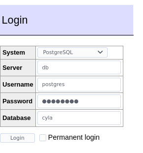

# Cyla

# Setup

## backend

1. `cd backend/`
1. `go get -d`

## frontend

1. `cd frontend`
1. `npm instal`
1. `npx react-native start`

## Docker

1. Create a `.env` file in the project root. Fill it according to `.env.example`.
1. Build docker container: `sudo docker build backend/air_with_dependencies --tag air_with_dependencies:v1.15.1`
1. Start all containers: `sudo docker-compose up`

### Docker Services

#### app
> Go backend with auto reloading using air

Port: 5000

#### db
> PostgreSQL database

Port: default

#### adminer
> DB inspection tool

Port: 8080

To login click [here](http://localhost:8080/?pgsql=db&username=postgres&db=cyla&password=postgres) and use the following settings (PW is postgres):

