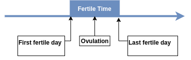
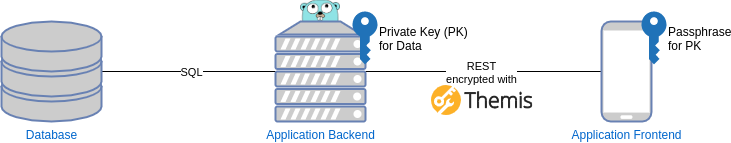

# Vision Privacy focused Period & Ovulation Tracker

                               

## Requirements statement 
### Motivation

Period & ovulation information is medical data. Current period tracking apps reportedly share user data with third parties. We believe that users should be in control of their data, especially when the data gives insights into a persons health and sexual activity.
We want to create an app for people who want to give birth as well as people who want to avoid pregnancy with a strong focus on privacy. 

### Problem description

Period & ovulation tracking is a natural family planning strategy. By following the menstrual cycle it is possible to better predict days with a higher risk of pregnancy. This can be used to prevent pregnancy by avoiding certain days or increase chances of conception. 

Period & ovulation tracking involves writing a diary with data about the strength of the menstruation, body basal temperature or cervix mucus, a method known as symptothermal method (STM). Additional data like cramps, mood, sexual activity or sexual desire can be noted to increase the accuracy of the tracking.

STM aims to detect the fertile phase once it occurs instead of predicting it beforehand. In combination with sexual abstinence, then this method is called natural family planning (NFP) and is categorized as a fertility awarness based (FAB) method for contraception.

As shown below the period can be divided into separate phases. For example a change in cervical secretion can indicate the first fertile day. An increase in body temperature can indicate the last fertile day.

{ width=250px }

It is not only of interest when ovulation and therefore the fertile time is, it is also of interest when the period starts or ends. Simplified calculations only include the average, minimum and maximum cycle length and its standard diviation. We call this method the simplified period estimation (SPE).

As there are multiple factors to keep track of, having a dedicated application on the cellphone or computer for period & ovulation tracking is a valuable tool for rigorous following of the method.

Although there are solutions already on the market, they store data on one device. This does not allow to synchronize between multiple devices and also makes it easy to lose data as there is no backup. This is a major problem, because accuracy increases with the number of cycles tracked [[1]][medical_paper].

Another problem with existing solutions is that they often overlook or disregard security concerns related to sensitive data. In fact, reports warn of applications that share and sell their data for profit [[2]](https://www.aerzteblatt.de/archiv/169142/Familienplanung-2-0-Besondere-Risiken-von-Fertilitaets-Apps).

### Project goal

Our main goal is to develop a period & ovulation tracking app for the following user groups:

* People who are able to give birth
  * People who *want* to become pregnant
  * People who *want to avoid* becoming pregnant
* Medical experts who want access the data with permission

It is our goals to provide the following features for our users:

* The user can collect and visualize relevant data for STM in a convinient way.
* Users can access their data across multiple devices.
* Users can restore their data in case they lose their devices.
* Data is saved and retrieved securily.
* Upon allowing so, the user can share their data with medical experts.
* The app should be free (as in freedom) and open-source software

## Scope statement

### System Architecture

We will use a standard three-layered architecture with an PostgreSQL database connected to a Go server and a React-Native frontend for Android devices. As security is one of our focuses, for transmission and persistance private data will be E2E-encrypted between the application's frontend and backend using the Themis framework.

### Technology stack

* Application Frontend:
    * [React-Native](https://reactnative.dev/)
    * [Android SDK/NDK](https://developer.android.com/studio)
    * [Themis](https://github.com/cossacklabs/themis) with Android wrapper
* Application Backend:
    * Go
    * [REST/OpenAPI](https://github.com/go-swagger/go-swagger)
    * [ORM-Mapper - GORM](https://gorm.io/index.html)
    * [Themis](https://github.com/cossacklabs/themis) with Go wrapper
* Database:
    * ~~[PostgreSQL](https://www.postgresql.org/)~~ Redis

### Project scope

By December 22nd we want to implemement the following features:

1. Find a name
1. Exactly one static user with static key and static password for static PK
1. Store a PK in the database
1. Store data for each day securely in the database
1. Allow to enter information in the app
1. Display the data in a calendar
1. Offer API for deletion

A further simplification is made for the 22nd:
* We will only use the user key for now
* The frontend will fetch all data (which is encrypted with the user key)
* The database structure will stay the same
* There is no client-side data-management -> View is refreshed completely

By March 9th we want to implement the following use cases:

1. Display statistics (average, minimum, maximum, std.dev., variance) about cycle length
1. Allow to update data in the app
1. Allow to delete data from the app
1. Login (Authentification) and registration for arbitrary users
1. STM calculations
1. Schedule Writes to the backend via WorkManager (Android)
1. Explainatory information in the app

[medical_paper]: https://academic.oup.com/humrep/article/22/5/1310/2914315 "title"
